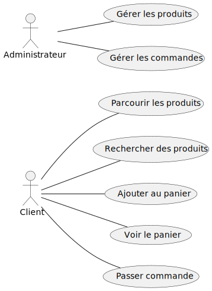
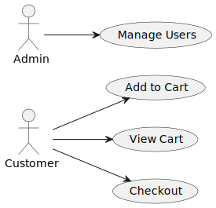

    
    

## **Whaches E-commerce**

- Présenté par: SUIRITA Fahd
- Encadré par: ESSARRAJ Fouad

---

### **1. Introduction:**

---

### **2. Contexte du projet:**

---

### **3. Methode de travail:**

- 3.1. Scrum
- 3.2. 2TUP
- 3.3. UX design

|||

#### **3.1. Scrum:**

|||

#### **3.2. 2TUP:**

|||

#### **3.3. UX design:**

---

### **4. Planification:**

|||

#### **4.1. Planification:**

<table style="font-size: 28px" >
  <tr>
    <th></th>
    <th>1</th>
    <th>2</th>
    <th>3</th>
  </tr>
  <tr>
    <td>Monday</td>
    <td>Planning</td>
    <td>Self Training</td>
    <td>Self Training</td>
  </tr>
  <tr>
    <td>Tuesday</td>
    <td>-</td>
    <td>-</td>
    <td>Prepering slides</td>
  </tr>
  <tr>
    <td>Wednesday</td>
    <td>Workshop</td>
    <td>Workshop</td>
    <td>Technical + Functional branches</td>
  </tr>
  <tr>
    <td>Thursday</td>
    <td>Prototype</td>
    <td>Fil rouge</td>
    <td>Prototype</td>
  </tr>
  <tr>
    <td>Friday</td>
    <td>Realization</td>
    <td>Realization</td>
    <td>-</td>
  </tr>
  <tr>
    <td>Monday</td>
    <td>Realization</td>
    <td>Realization</td>
    <td>Realization</td>
  </tr>
  <tr>
    <td>Tuesday</td>
    <td>-</td>
    <td>-</td>
    <td>Realization</td>
  </tr>
  <tr>
    <td>Wednesday</td>
    <td>Realization</td>
    <td>Realization</td>
    <td>Realization</td>
  </tr>
  <tr>
    <td>Thursday</td>
    <td>Realization</td>
    <td>Realization</td>
    <td>Realization</td>
  </tr>
  <tr>
    <td>Friday</td>
    <td>Realization</td>
    <td>Realization</td>
    <td>-</td>
  </tr>
</table>

|||

#### **4.2. Diagramme de Gantt:**

---

### **5. Branche technique:**

- 5.1. Capture de besoins techniques
- 5.2. Analyse technique
- 5.3. Auto-formation

|||

#### **5.1. Capture de besoins techniques:**

- Tailwind CSS
- Ajax
- Laravel
- MySQL

|||

#### **5.2. Analyse technique:**

- Advenced Laravel
- One page application (AJAX)

|||

#### **5.3. Auto-formation:**

- Advenced Blade
- Advenced Controller
- Advenced Model
- Manager
- Ajax

|||

---

### **6. Branche fonctionnelle:**

- 6.1. Carte d’empathie
- 6.2. Définir le problème
- 6.3. Idéation
- 6.4. Diagramme de cas d’utilisation sprint 1
- 6.5. Diagramme de cas d’utilisation sprint 2

|||

#### **6.1. Carte d’empathie:**

|||

#### **6.2. Définir le problème:**

|||

#### **6.3. Idéation (diagramme de cas d’utilisation):**

|||

#### **6.4. Diagramme de cas d’utilisation sprint 1:**

|||

#### **6.5. Diagramme de cas d’utilisation sprint 2:**

---

### **7. Conception:**

- 7.1. Diagramme de class
- 7.2. Maquette

|||

#### **7.1. Diagramme de class:**

|||

#### **7.2. Maquette:**

|||

### **8. Réalisation:**

---

### **9. Conclusion:**
